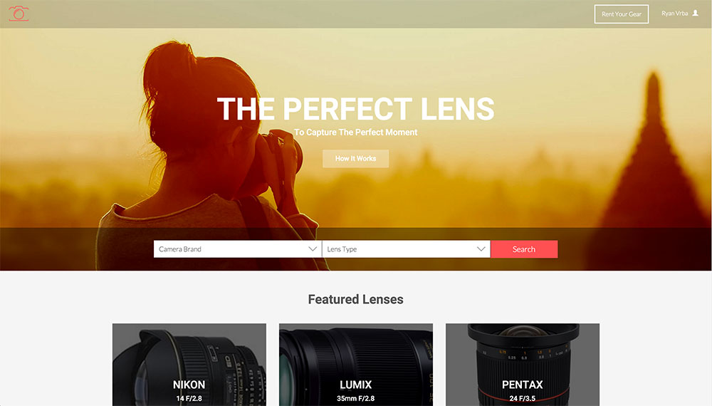

# Share-A-Lens

Going on a trip and need a particular lens? *SHARE-A-LENS!*
Want to try out a camera lens before you buy? *SHARE-A-LENS!*
Have extra lenses lying around and strapped for cash? *SHARE-A-LENS!*

Share-A-Lens provides a lens sharing community to photographers all around the world.

### Quick Setup

You can clone this project with the following URL:

` https://github.com/supermanrising/sharealens.git `

1. Navigate to the sharealens directory inside the vagrant environment

2. Run database_setup.py to create the database

3. Run lotsoflenses.py to populate the database

4. Run main.py and navigate to localhost:5000 in your browser

### Using the App

The app will initially load the home page.

You can search for lenses by selecting a camera brand and lens type, and pressing the "Search" button.

Search results can be filtered by using the radio input fields on the left hand side of the search results page.

Click on any lens to view lens details.  You can request to rent the lens by clicking the "Request Rental" button below the lens details

Choose your desired dates and click "Request Rental" to finalize the lens rental process.  Dates that are unavailable will be disabled in the date selector.

To upload your own lens for rent, login and click the "Rent Your Gear" button in the top navigation.

You can then upload your own lens, along with an image.

Once uploaded, the lens will appear on your account page under the "My Lenses" tab.  You can navigate to your account page at anytime by clicking on your name in the main navigation, then choosing "My Account" from the dropdown menu.

From here, you can delete your lenses (Deleting lenses is protected from CSRF), edit your lenses, and view your lens rentals by clicking the "My Rentals" tab.

### API's

Share-A-Lens provides JSON and XML API endpoints for computer readable data.  You can access this data by going to the following URL's:

`localhost:5000/lenses/JSON`
`localhost:5000/lenses/XML`
`localhost:5000/lens/<int:lens_id>/JSON`
`localhost:5000/lens/<int:lens_id>/XML`

Virtual Photo Walks uses the following Javascript libraries / extensions:

* [Bootstrap 3 DatePicker v4](https://eonasdan.github.io/bootstrap-datetimepicker/)
* [Moment.js](http://momentjs.com/)
